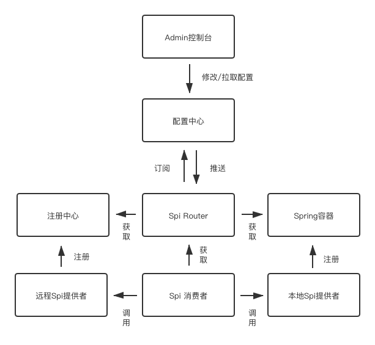
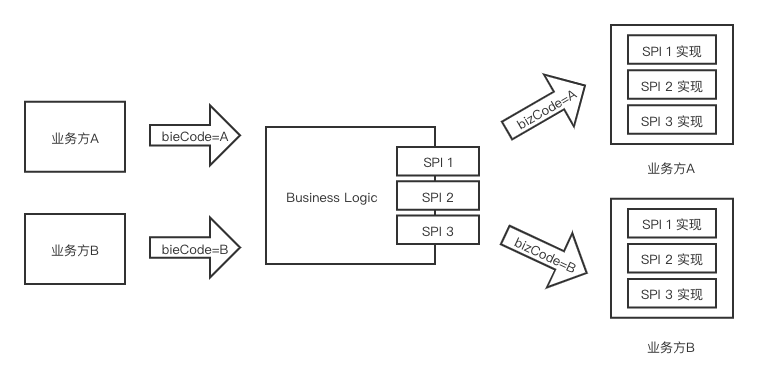

## 这是什么
相对于普通spi，你只能调用同jvm中的spi实现，本框架支持对远程spi的调用。

## 架构图


## 调用逻辑图


## 如何使用
### maven依赖
```
<dependency>
    <groupId>com.cmt</groupId>
    <artifactId>extension-core</artifactId>
    <version>1.1.0-SNAPSHOT</version>
</dependency>
```
### spi消费者
1. 增加spring配置
```
@Bean
public SpiConsumerBootStrap spiBootStrap() {
    SpiConsumerBootStrap spiBootStrap = new SpiConsumerBootStrap();
    spiBootStrap.setAppName("test");
    return spiBootStrap;
}
```  
> appName需要和控制台一致  

2. 标记SPI接口
  给需要作为扩展点的接口加上SPI注解 
  ```java
@SPI
public interface IHelloService {
    String hello();
}
```
3. 注入spi
```
@Resource(name = "IHelloService")
IHelloService helloService;
```
使用spring的@Resource注解，name和接口名一致

4.注册本地默认实现
```
//@Extension(bizCode = DEFAULT_BIZ_CODE,invokeMethod = SpiTypeEnum.LOCAL)
@Extension
public class DefaultHelloServiceImpl implements IHelloService {
    public String hello() {
        return "default hello";
    }
}
```
当找不到bizCode对应的spi时，调用spi默认实现。


5. 注册spi本地实现(可选)  
```
@Extension(bizCode = "d",invokeMethod = SpiTypeEnum.LOCAL)
public class LocalHelloServiceImpl implements IHelloService {
    public String hello() {
        return "local";
    }
}
```


6. 调用
在该spi在被调用前，需要通过BusinessContext设置bizCode才能路由到正确的spi实现
```
BusinessContext.setBizCode("a");
testService.hello();
```

### spi提供者
1. 增加spring配置
```
@Bean
public  SpiProviderBootStrap businessBootStrap() {
    return new SpiProviderBootStrap();
}
```
2. 提供spi接口远程实现
```
@Extension(bizCode = "a", invokeMethod = SpiTypeEnum.DUBBO)
public class AHelloServiceImpl implements IHelloService{
    public String hello() {
        return "HelloA";
    }
}
```

### 配置admin控制台
为了让spi消费者能够正常消费远程/本地spi，需要在admin控制台注册你的spi实现
[如何使用]()

## 示例
见源码extension-demo项目
